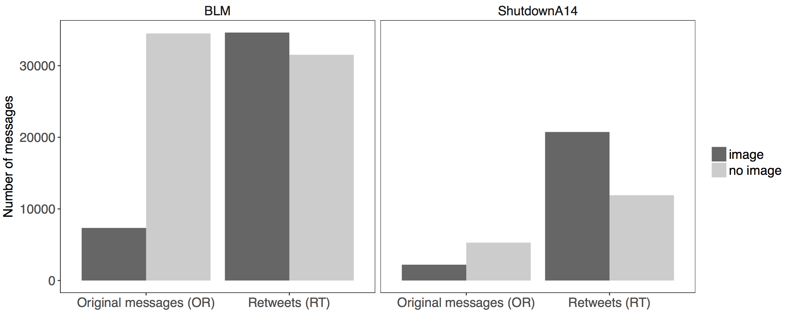
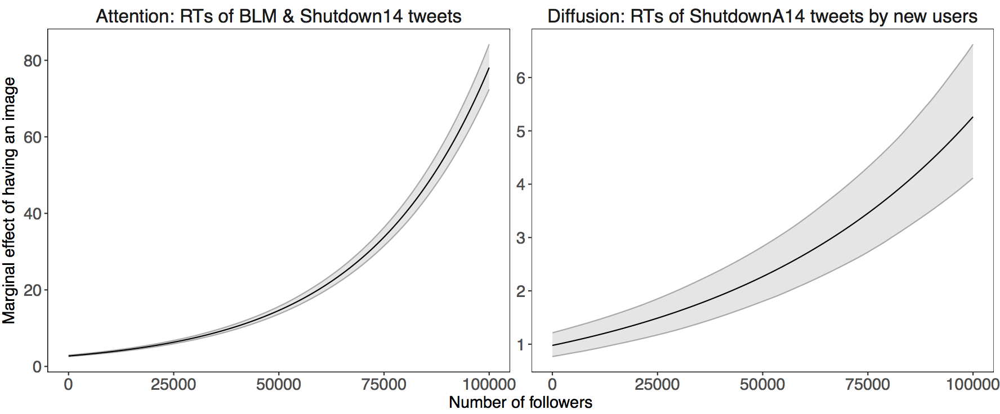

# Images That Matter: Online Protests and the Mobilizing Role of Pictures
Online Appendix and Replication materials for the [paper](http://andreucasas.com/casas_webb_williams_Images_That_Matter_25April2017.pdf) by Andreu Casas (University of Washington) and Nora Webb Williams (University of Washington).

## Files Description:
- `Online Appendix`: This is a PDF containing all the Appendices of the paper:
  - A. Image Labeling Procedures and Summary Statistics Table
  - B. Interrater Reliability, Evidence of Stable Emotions Labeling, and Turker Demographics
  - C. Regression Analysis Results Table
  
- [`00_functions.R`](https://github.com/CasAndreu/Images_That_Matter/blob/master/code/00_functions.R): Script with some functions we use in this project.
  
- [`01_figure_1.R`](https://github.com/CasAndreu/Images_That_Matter/blob/master/code/01_figure_1.R): Code to replicate Figure 1.

  

  

- [`02_figure_2.R`](https://github.com/CasAndreu/Images_That_Matter/blob/master/code/02_figure_2.R): Code to replicate Figure 2.

  

- [`03_model_estimation.R`](https://github.com/CasAndreu/Images_That_Matter/blob/master/code/03_model_estimation.R): Estimating the 4 models of the paper. The fitted models are saved in the `./models/` directory.

- [`04_figure_3.R`](https://github.com/CasAndreu/Images_That_Matter/blob/master/code/04_figure_3.R): Code to replicate Figure 3.

  

- [`05_figure_4.R`](https://github.com/CasAndreu/Images_That_Matter/blob/master/code/05_figure_4.R): Code to replicate Figure 4.

  

- [`06_figure_5.R`](https://github.com/CasAndreu/Images_That_Matter/blob/master/code/06_figure_5.R): Code to replicate Figure 5.

  

- [`07_figure_6_and_7.R`](https://github.com/CasAndreu/Images_That_Matter/blob/master/code/07_figure_6_and_7.R): Code to replicate Figure 6 and 7.

  

  

