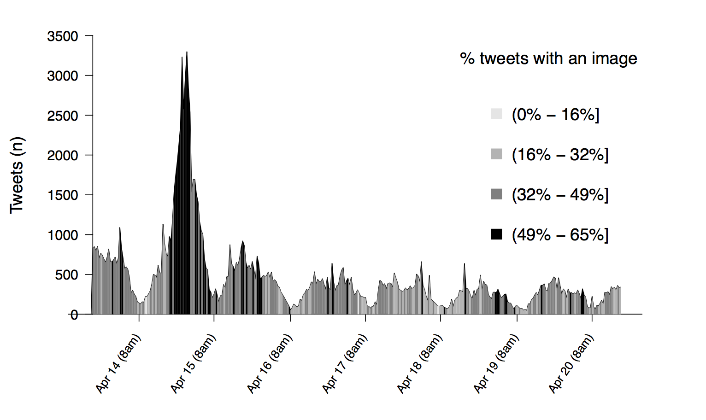

# Images That Matter: Online Protests and the Mobilizing Role of Pictures
Online Appendix and Replication materials for the [paper](http://andreucasas.com/casas_webb_williams_Images_That_Matter_25April2017.pdf) by Andreu Casas (University of Washington) and Nora Webb Williams (University of Washington).

## Files Description:
- `Online Appendix`: This is a PDF containing all the Appendices of the paper:
  - A. Image Labeling Procedures and Summary Statistics Table
  - B. Interrater Reliability, Evidence of Stable Emotions Labeling, and Turker Demographics
  - C. Regression Analysis Results Table
  
- [`01_figure_1.R`](https://github.com/CasAndreu/Images_That_Matter/blob/master/code/01_figure_1.R): Code to replicate Figure 1.

  

  

